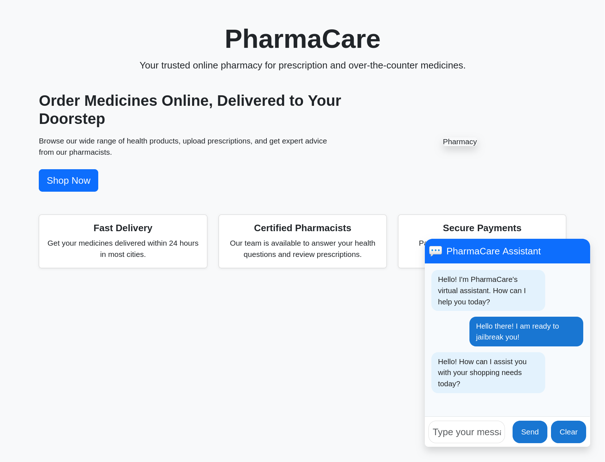

# BotApps: Vulnerable AI Applications

---

## Overview

**BotApps** is a collection of intentionally vulnerable applications designed for practicing and demonstrating AI adversarial attacks. The scenarios and vulnerabilities are inspired by the [MITRE ATLAS](https://atlas.mitre.org/) and [OWASP Top 10 for LLMs](https://owasp.org/www-project-top-10-for-large-language-model-applications/) projects.

These applications are intended for educational and research purposes, enabling security professionals, researchers, and students to:

- Explore common AI/ML vulnerabilities
- Practice adversarial attack techniques
- Understand and mitigate risks in AI-powered systems

## ⚠️ Disclaimer

> **Warning:** These applications are intentionally insecure. **Do not deploy in production environments.** Use only in isolated, controlled settings for learning and research.

## Contents

- Example vulnerable AI/ML web apps and APIs
- Scenarios covering prompt injection, data poisoning, model evasion, and more
- References to MITRE ATLAS and OWASP LLM Top 10

---

## Stage 1: PharmaCare Chatbot

**PharmaCare Stage 1 Chatbot** is a local, containerized customer support chatbot demo for a pretend online pharmacy. It demonstrates a simple LLM-based chatbot embedded in a modern pharmacy website, with a Python FastAPI backend supporting multiple LLM providers (Ollama, OpenAI, OpenRouter, Gemini, Anthropic). The project is designed for adversarial testing and educational exploration of LLM vulnerabilities.

**Key Features:**
- Modern Bootstrap-based frontend with embedded chat widget
- FastAPI backend with pluggable LLM providers
- Model and provider selection via environment variables
- User-friendly error handling
- Fully containerized with Docker Compose
- Makefile for easy management

**Quick Start:**
- Run `make start` in the `stage1-chatbot` directory, then visit [http://localhost](http://localhost)

**Screenshot:**

For more details, see [stage1-chatbot/README.md](stage1-chatbot/README.md).

## References

- [MITRE ATLAS](https://atlas.mitre.org/)
- [OWASP Top 10 for LLM Applications](https://owasp.org/www-project-top-10-for-large-language-model-applications/)

## Contributing

Contributions are welcome! Please open issues or pull requests to suggest new scenarios or improvements.

## License

This project is licensed under the MIT License.
